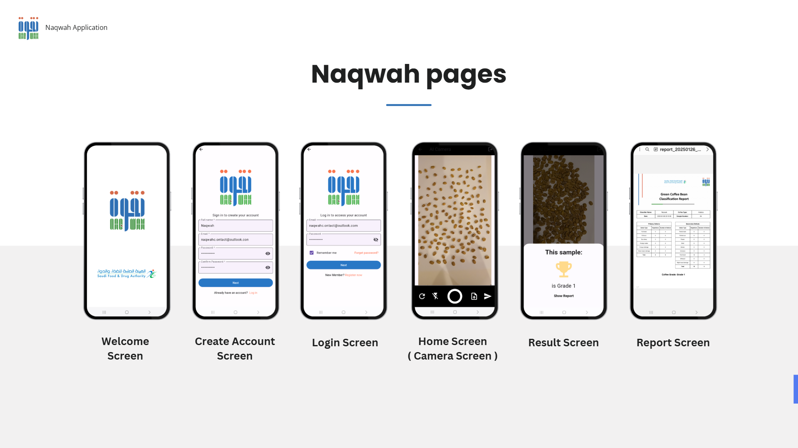

  

# Naqwah – AI-powered Coffee Bean Quality Assessment App ☕

**Naqwah** is a mobile application that leverages **YOLOv8 object detection** to **automate the grading of coffee beans**.  
This project was developed as my **graduation project** for the **Computer Science program at Imam Mohammad Ibn Saud Islamic University**.

---

## 🎯 Project Objective

Manual inspection of coffee beans is time-consuming, subjective, and prone to inconsistencies.  
**Naqwah** solves this by offering an automated, AI-based solution that:

- Detects and counts 16 types of coffee bean defects + 1 "Good" category.
- Grades coffee quality based on **Saudi Food and Drug Authority (SFDA)** standards.
- Generates an automatic PDF inspection report.
- Streamlines quality control with high accuracy and minimal human effort.

---

## 🛠 Tools Used

- **Figma** (UI/UX Design)  
- **Flutter** (Frontend)  
- **YOLOv8** (AI Model)  
- **FastAPI** (Backend)  
- **MySQL** (Database)  
- **Render & Railway** (Deployment)  

---

## 🧾 Features

- Upload image of coffee beans for real-time detection
- View total number of defects per image
- See assigned grade based on SFDA standards
- Automatically generated PDF report (excluding images)
- Fast, accurate, and consistent quality inspection

---

## 📱 App Screenshots

  

---

## 🧠 Model Overview

- 🔍 Detection Model: YOLOv8 (Ultralytics)
- 📦 Dataset: Custom-labeled dataset following SFDA defect categories
- 🧪 Evaluation Metrics: mAP, Precision, Recall, F1-Confidence, Confusion Matrix

---

## 📈 Model Performance Summary

### 🔹 Training & Validation Highlights

| **Phase**      | **Metric**              | **Observation**                                                               |
|----------------|-------------------------|--------------------------------------------------------------------------------|
| **Training**   | `train/box_loss`        | Consistent and steady decrease                                                |
|                | `train/cls_loss`        | Decreasing with noticeable stability                                          |
|                | `train/obj_loss`        | Clear downward trend, showing strong object detection                         |
|                | `metrics/precision(B)`  | Gradual and steady increase, reaches high performance                         |
|                | `metrics/recall(B)`     | Gradual improvement, slightly lower than precision                            |
| **Validation** | `val/box_loss`          | Low and stable, no signs of overfitting                                       |
|                | `val/cls_loss`          | Slight fluctuations, but generally stable                                     |
|                | `val/obj_loss`          | Gradual decrease, indicating good generalization                              |
|                | `metrics/mAP50`         | Very high performance, above **0.9**                                          |
|                | `metrics/mAP50-95`      | Excellent given model complexity, around **0.7 – 0.8**                         |

### 🔹 Confusion Matrix Accuracy

- 📌 Suggests potential improvement with more augmentation and clearer labeling.

### 🔹 F1-Confidence Curve

- **Best F1-score**: 0.98 at **confidence threshold 0.431**
- Indicates optimal balance between precision and recall.

---

## 🏆 Achievements

- 🥇 **1st Place Winner** at the **Computer Science Department Projects Exhibition**.

---

## 🚫 Source Code

> This repository is intended for **demo and showcase purposes only**.  
> **The source code is not publicly available.**
